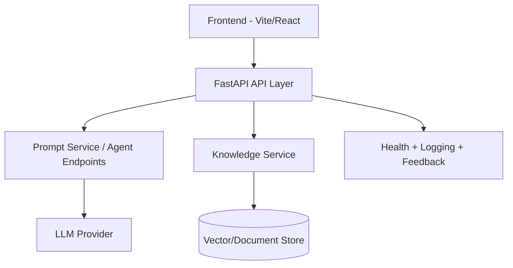

# Vidhi Monorepo

Vidhi is an AI-assisted legal workflow platform with:
- a **FastAPI backend** for agent orchestration, knowledge retrieval, and guarded generation,
- a **TypeScript frontend** for user interaction,
- and **shared contracts** for typed interoperability.

## Architecture at a glance



## Repository structure

```text
.
├── backend/
│   ├── app/
│   │   ├── knowledge/          # ingestion, embeddings, retrieval
│   │   ├── prompts/            # core and module prompts + builder
│   │   ├── services/           # orchestration services
│   │   ├── main.py             # FastAPI app + routes
│   │   ├── request_models.py   # validated request DTOs
│   │   └── response_models.py  # response contracts
│   ├── data/knowledge/         # local seed knowledge
│   ├── requirements.txt
│   └── smoke_test.py
├── docs/architecture/          # architecture and deployment docs
├── frontend/                   # Vite + React app
├── packages/contracts/         # shared TypeScript contracts
├── tests/
│   ├── integration/
│   └── unit/
├── scripts/                    # local backend helper scripts (PowerShell)
└── .github/workflows/ci.yml
```

## Quick start

### 1) Prerequisites
- Python 3.10+
- Node.js 20+
- npm 10+

### 2) Clone and configure

```bash
git clone <repo-url>
cd Vidhi
cp .env.example .env
```

### 3) Install dependencies

Backend:

```bash
python -m venv .venv
source .venv/bin/activate  # Windows: .venv\\Scripts\\activate
pip install -r backend/requirements.txt
```

Frontend + workspace packages:

```bash
npm install
```

### 4) Run services

Backend API:

```bash
uvicorn backend.app.main:app --reload --host 0.0.0.0 --port 8000
```

Frontend:

```bash
npm run dev
```

## API usage examples

### Health check

```bash
curl http://localhost:8000/api/v1/health
```

### Issue Spotter agent

```bash
curl -X POST http://localhost:8000/api/v1/agents/issue-spotter \
  -H "Content-Type: application/json" \
  -d @backend/sample-issue-input.json
```

### Knowledge search

```bash
curl "http://localhost:8000/api/v1/knowledge-base/search?q=bail&k=5"
```

## Testing

Run Python tests:

```bash
python -m pytest -q
```

## Documentation

- System architecture: `docs/architecture/system_architecture.md`
- Sequence flow: `docs/architecture/sequence_diagram.md`
- Multi-agent architecture: `docs/architecture/multi_agent_architecture.md`
- Deployment references:
  - `docs/architecture/Docker_Infrastructure_architecture.md`
  - `docs/architecture/OnPrem_Deployment_diagram.md`
- API reference: `docs/api.md`
- Prompt strategy: `docs/prompt-strategy.md`
- Versioning strategy: `docs/versioning.md`
- Configuration management: `docs/configuration.md`

## CI

GitHub Actions CI lives at `.github/workflows/ci.yml` and is intended to run lint, tests, and builds on pull requests.

## Community and governance

- Contribution guide: `CONTRIBUTING.md`
- Code of Conduct: `CODE_OF_CONDUCT.md`

## License

MIT — see `LICENSE`.
