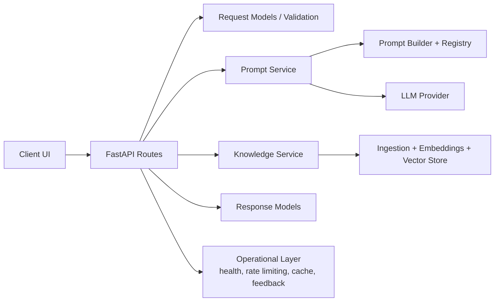
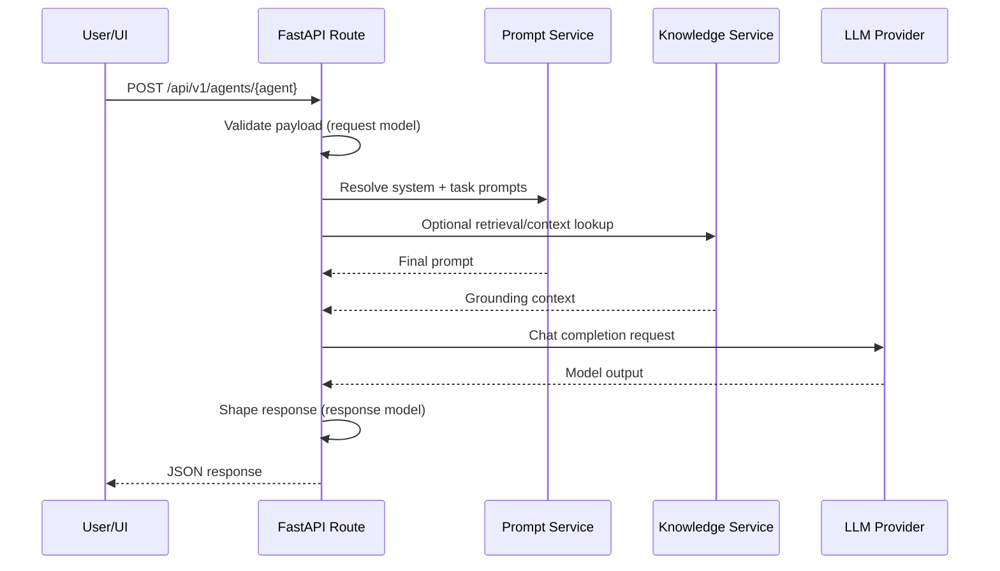

# Vidhi Architecture

This document provides a single, implementation-aligned overview of Vidhi system components and runtime flow.

## 1) System context

Vidhi is organized as a monorepo with three primary runtime surfaces:

- **Frontend (Vite/React):** user interaction and workflow execution UI.
- **Backend (FastAPI):** API gateway, agent orchestration, prompt composition, knowledge operations, and operational endpoints.
- **Contracts package (TypeScript):** shared schemas/interfaces for frontend-backend interoperability.

## 2) Logical component model

### Backend component responsibilities

| Component | Path | Responsibility |
|---|---|---|
| API entrypoint | `backend/app/main.py` | Route registration, middleware, rate limiting, caching, health checks, request handling |
| Request contracts | `backend/app/request_models.py` | Input schema validation for API payloads |
| Response contracts | `backend/app/response_models.py` | Typed API response envelopes |
| Prompt service | `backend/app/services/prompt_service.py` | Resolves and composes system/task prompts |
| Prompt builder/registry | `backend/app/prompts/` | Core + module prompts and composition logic |
| Knowledge service | `backend/app/knowledge/` | Search, ingestion pipeline, embeddings, and repository adapters |

## 3) Primary request flow

## 4) Knowledge and prompt architecture details

- Prompt composition pulls from `core/` and `modules/` assets via registry and builder utilities.
- Agent endpoints (issue spotter, case finder, limitation checker, etc.) map task intent to prompt modules.
- Knowledge operations include seed data ingestion, retrieval, and optional live-search/provision workflows.

## 5) Operational concerns

- **Health checks:** `/api/v1/health` for service status and dependencies.
- **Rate limiting:** request window and per-client caps configurable with environment variables.
- **Response caching:** in-memory TTL + stale cache support for repeated requests.
- **Embedding caching:** in-memory LRU cache for deterministic embedding reuse.
- **Async queue abstraction:** in-memory queue layer for background jobs exposed via `/api/v1/queue/stats`.
- **Feedback loop:** feedback endpoints support operational monitoring and iterative improvement.

## 6) Deployment note

For deployment topology and infra-oriented views, see existing architecture references under:

- `docs/architecture/system_architecture.md`
- `docs/architecture/sequence_diagram.md`
- `docs/architecture/multi_agent_architecture.md`
- `docs/architecture/Docker_Infrastructure_architecture.md`
- `docs/architecture/OnPrem_Deployment_diagram.md`
