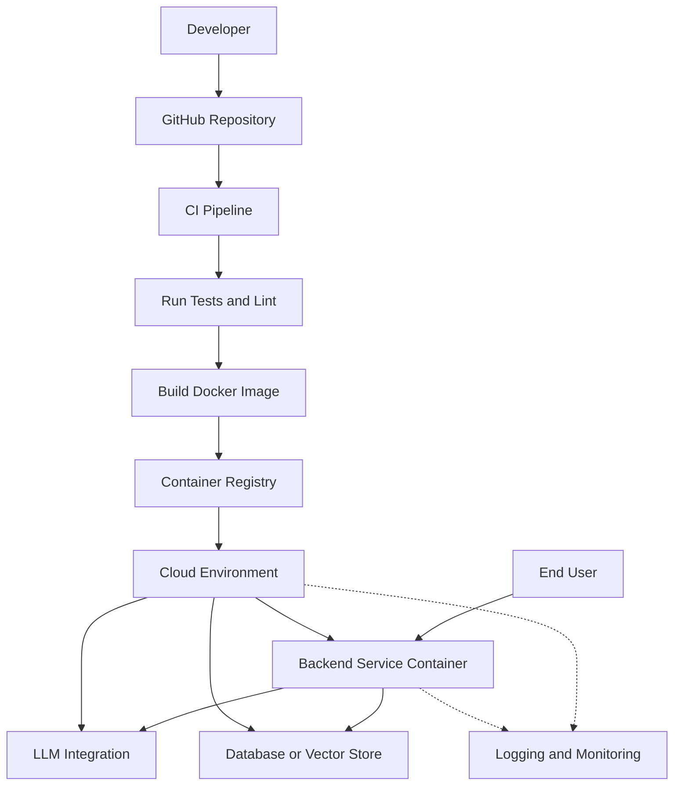

## ☁️ Infrastructure Architecture (Production Setup)

```mermaid
flowchart TD

%% Developer Flow
A[Developer] --> B[GitHub Repository]

%% CI/CD
B --> C[CI Pipeline]
C --> D[Run Tests and Lint]
D --> E[Build Docker Image]

%% Registry
E --> F[Container Registry]

%% Deployment
F --> G[Cloud Environment]

%% Runtime Services
G --> H[Backend Service Container]
G --> I[LLM Integration]
G --> J[Database or Vector Store]

%% Networking
H --> I
H --> J

%% Observability
H -.-> K[Logging and Monitoring]
G -.-> K

%% User Access
U[End User] --> H
```
