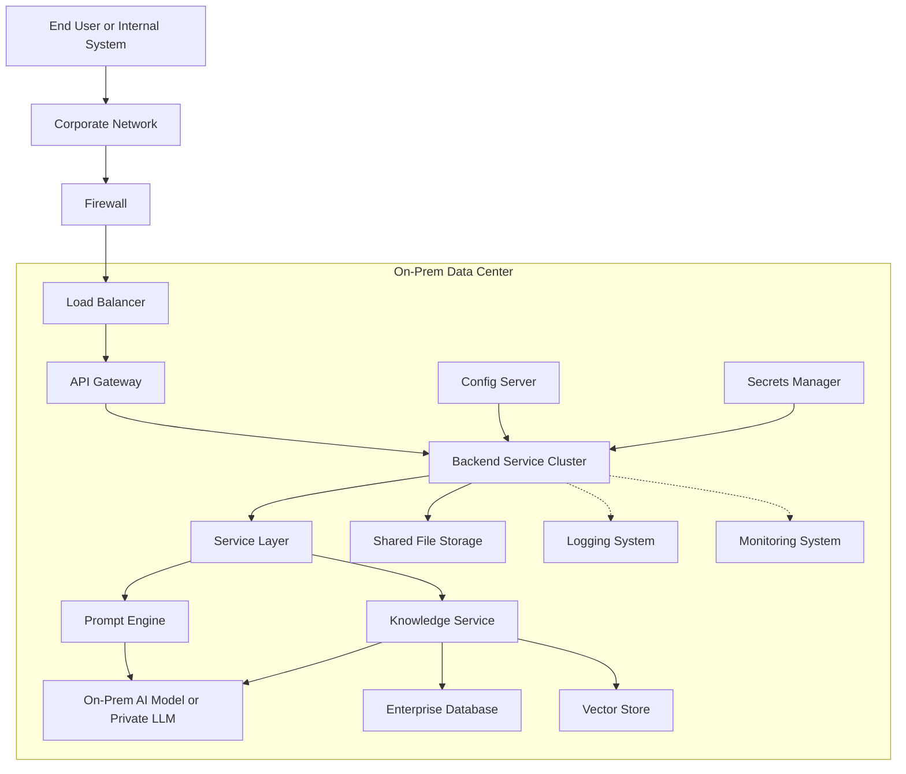

## 🏢 On-Premise Deployment Architecture

```mermaid id="g3kq2x"
flowchart TD

%% User Access Layer
A[End User or Internal System] --> B[Corporate Network]

%% Security Layer
B --> C[Firewall]
C --> D[Load Balancer]

%% Application Layer
D --> E[API Gateway]
E --> F[Backend Service Cluster]

%% Service Components
F --> G[Service Layer]
G --> H[Prompt Engine]
G --> I[Knowledge Service]

%% AI/LLM Layer
H --> J[On-Prem AI Model or Private LLM]
I --> J

%% Data Layer
I --> K[Enterprise Database]
I --> L[Vector Store]

%% Shared Storage
F --> M[Shared File Storage]

%% Config & Secrets
N[Config Server] --> F
O[Secrets Manager] --> F

%% Observability
F -.-> P[Logging System]
F -.-> Q[Monitoring System]

%% Internal Network Boundaries
subgraph DataCenter[On-Prem Data Center]
    D
    E
    F
    G
    H
    I
    J
    K
    L
    M
    N
    O
    P
    Q
end
```
