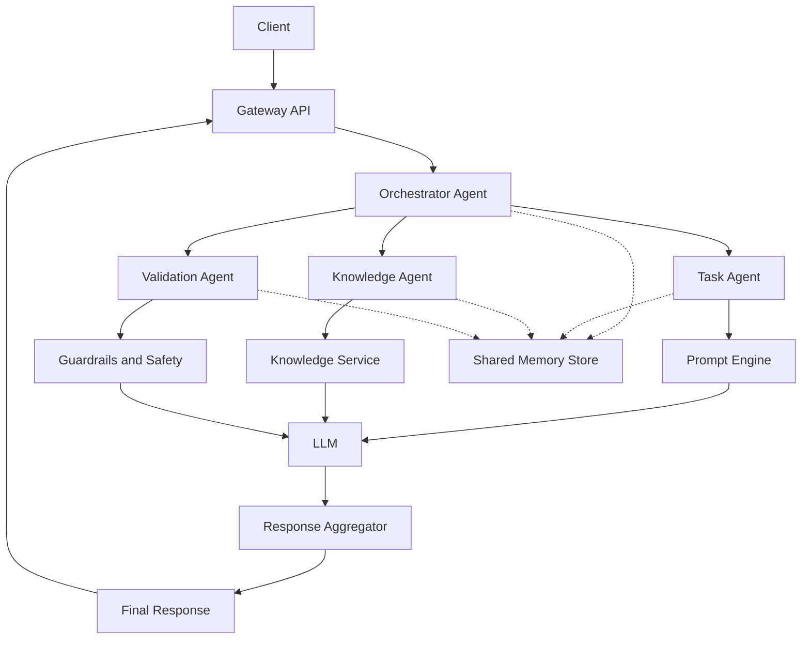

## 🤖 Multi-Agent Architecture (Future Ready)

```mermaid
flowchart TD

A[Client] --> B[Gateway API]

B --> C[Orchestrator Agent]

C --> D1[Task Agent]
C --> D2[Knowledge Agent]
C --> D3[Validation Agent]

D1 --> E1[Prompt Engine]
D2 --> E2[Knowledge Service]
D3 --> E3[Guardrails and Safety]

E1 --> F[LLM]
E2 --> F
E3 --> F

F --> G[Response Aggregator]

G --> H[Final Response]
H --> B

%% Optional memory layer
C -.-> M[Shared Memory Store]
D1 -.-> M
D2 -.-> M
D3 -.-> M
```
