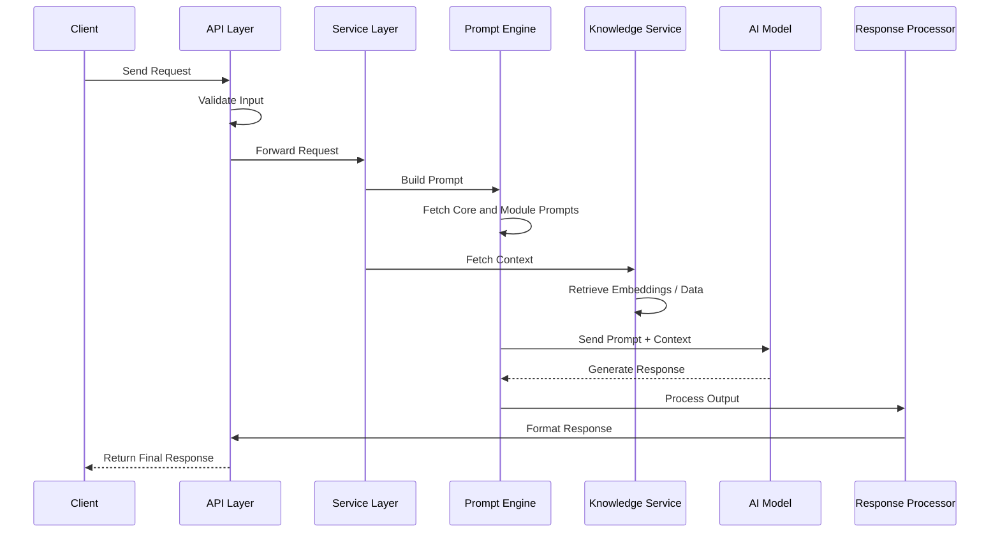

## 🔁 Agent Interaction Flow (Sequence Diagram)

```mermaid
sequenceDiagram
    participant U as Client
    participant API as API Layer
    participant S as Service Layer
    participant P as Prompt Engine
    participant K as Knowledge Service
    participant LLM as AI Model
    participant R as Response Processor

    U->>API: Send Request
    API->>API: Validate Input
    API->>S: Forward Request

    S->>P: Build Prompt
    P->>P: Fetch Core and Module Prompts

    S->>K: Fetch Context
    K->>K: Retrieve Embeddings / Data

    P->>LLM: Send Prompt + Context
    LLM-->>P: Generate Response

    P->>R: Process Output
    R->>API: Format Response
    API-->>U: Return Final Response
```
