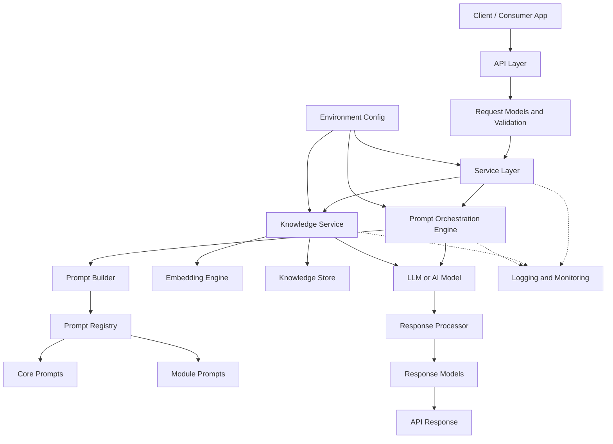

## 🏗️ System Architecture

```mermaid
flowchart TD

%% Client Layer
A[Client / Consumer App] --> B[API Layer]

%% API Layer
B --> C[Request Models and Validation]
C --> D[Service Layer]

%% Service Layer
D --> E[Prompt Orchestration Engine]
D --> F[Knowledge Service]

%% Prompt System
E --> G[Prompt Builder]
G --> H[Prompt Registry]
H --> I[Core Prompts]
H --> J[Module Prompts]

%% Knowledge Layer
F --> K[Embedding Engine]
F --> L[Knowledge Store]

%% Integration Layer
E --> M[LLM or AI Model]
F --> M

%% Response Handling
M --> N[Response Processor]
N --> O[Response Models]
O --> P[API Response]

%% Observability (Future)
D -.-> Q[Logging and Monitoring]
F -.-> Q
E -.-> Q

%% Config Layer
R[Environment Config] --> D
R --> F
R --> E
```
